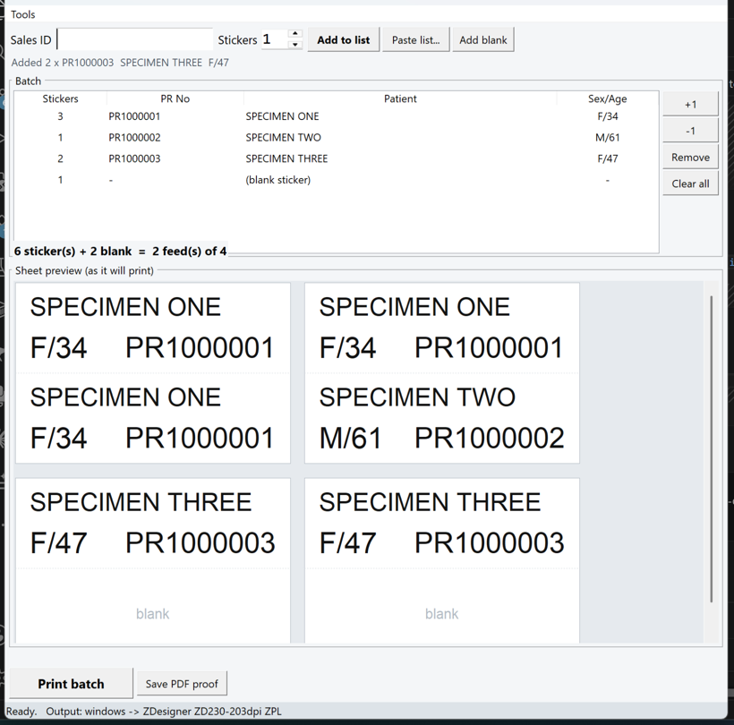
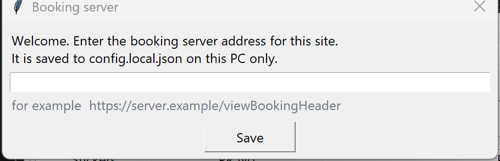
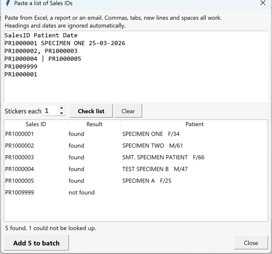
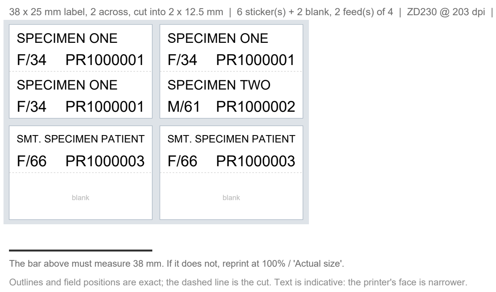

# Molecular Pathology — Tube Label Printer

Prints patient identification stickers for Eppendorf tubes on a **Zebra ZD230**.
A technician scans a Sales ID, the patient is looked up from the lab's booking
system, and a batch of stickers is printed — any mix of patients and counts, in
one pass.

<p align="center">
  
</p>

<p align="center">
  <code>Python 3.10+</code> · <code>Windows</code> · <code>Zebra ZD230</code> ·
  <code>ZPL II</code> · <code>no runtime dependencies beyond requests + pywin32</code>
</p>

---

## Contents

- [What it does](#what-it-does)
- [The label stock](#the-label-stock)
- [Installation](#installation)
- [First run](#first-run)
- [Daily use](#daily-use)
- [Pasting a list](#pasting-a-list)
- [PDF proof](#pdf-proof)
- [Command line](#command-line)
- [Configuration](#configuration)
- [Troubleshooting](#troubleshooting)
- [How text is fitted](#how-text-is-fitted)
- [Development](#development)
- [Privacy](#privacy)

---

## What it does

Each sticker carries two lines and no barcode:

```
SMT. SPECIMEN PATIENT
F/66            PR9000001
```

Patient name on top; sex and age bottom-left; PR number bottom-right.

| | |
|---|---|
| **Batch queue** | any mix of patients and per-patient counts in one print run |
| **Bulk paste** | paste a whole lab list — any separators — and queue it in one go |
| **Blank stickers** | leftover slots are left genuinely blank, never reused |
| **Nothing overflows** | both lines auto-shrink to fit inside 2 mm padding |
| **Live preview** | see the sheet exactly as it will come off the printer |
| **PDF proof** | actual-size sheet you can lay against the real stock |
| **Setup checker** | one command tells you whether a new PC is ready |

---

## The label stock

The liner carries **38 × 25 mm labels, 2 across**. Each label is slit
horizontally across its middle into two **12.5 mm** stickers, with **no gap** at
the cut. The gap sensor only sees the 25 mm pitch between whole labels:

```
┌────────────────────────┬────────────────────────┐  ← one 38 × 25 mm label
│ SPECIMEN ONE           │ SPECIMEN TWO           │
│ F/34      PR1000001    │ M/61      PR1000002    │
├╌╌╌╌╌╌╌╌╌╌╌╌╌╌╌╌╌╌╌╌╌╌╌╌┼╌╌╌╌╌╌╌╌╌╌╌╌╌╌╌╌╌╌╌╌╌╌╌╌┤  ← the cut, no gap
│ SPECIMEN THREE         │ blank                  │
│ F/47      PR1000003    │                        │
└────────────────────────┴────────────────────────┘
        38 mm         2 mm         38 mm             ← liner between columns
```

```
one feed  =  one 38 × 25 mm label, 2 across
          =  2 columns × 2 slit halves
          =  4 stickers
```

**Batches round up to a multiple of 4.** Slots fill in reading order — top-left,
top-right, then the two halves below. Leftovers are printed blank, so a stray
sticker can never carry the previous patient's details. You can also add blanks
deliberately with **Add blank**.

If your stock differs, `columns`, `rows`, `sticker_width_mm` and
`sticker_height_mm` in `config.json` describe it; everything else follows.

---

## Installation

On the PC connected to the ZD230:

**1. Install Python 3.10 or newer** from [python.org](https://www.python.org/downloads/),
ticking **Add Python to PATH** on the installer's first screen.

**2. Clone the repository:**

```
git clone https://github.com/abhirup780/molpath-printer-1.git
cd molpath-printer-1
```

**3. Run the scripts in order:**

| Script | What it does |
|---|---|
| **`1 - Setup.bat`** | installs the two Python libraries and puts a **Tube Label Printer** shortcut on the Desktop |
| **`2 - Check Setup.bat`** | verifies Python, config, booking server and printer, then says plainly whether the PC is ready |
| **`Label Printer.bat`** | starts the app — same as the Desktop shortcut |

### Printer driver

You need the **ZDesigner ZD230 — ZPL** driver, which is what the ZD230 ships
with. The queue is usually named `ZDesigner ZD230-203dpi ZPL`.

The app does **not** render through the driver. It opens the queue in Windows
RAW mode and sends ZPL straight to the printer, so driver page sizes, margins
and orientation are irrelevant and cannot break the layout. Only the driver
*variant* matters:

- **ZPL** in the name — correct, nothing to do
- **EPL** in the name — wrong language; reinstall choosing ZPL
- **300 dpi** in the name — set `"dpi": 300` in `config.json`

`2 - Check Setup.bat` flags all three explicitly.

If the ZD230 is on the network or Wi-Fi, skip the driver entirely: set
`"output_mode": "tcp"` and `"tcp_host": "<printer IP>"` in `config.local.json`.

---

## First run

**The booking server address is deliberately not in the source code.** That
endpoint returns patient demographics, so its address does not travel with the
repository.

The first time the app starts on a PC, it asks:

<p align="center">
  
</p>

Paste the address, click **Save**, and it is written to `config.local.json` on
that PC only. You never need to touch it again. Change it later with
**Tools → Booking server URL…**.

<details>
<summary>Alternatives, if you prefer to prepare the PC beforehand</summary>

Copy the template and edit `api_url`:

```
copy config.local.example.json config.local.json
```

Or set an environment variable, which overrides both files — useful for
pointing at a test instance:

```
set MOLPATH_API_URL=https://your-server/viewBookingHeader
```
</details>

### Then, once

1. **Tools → Choose printer…** — auto-detects if there is only one Zebra queue.
2. **Tools → Calibrate media** — the printer feeds a few blank labels while it
   learns the 25 mm gap. Repeat whenever you change label rolls.
3. **Tools → Print test label** — prints one feed with all four positions
   filled, so you can check alignment everywhere at once.
4. If alignment is off, adjust `column_gap_mm` / `left_margin_mm` /
   `top_margin_mm` in `config.json`, then **Tools → Reload config.json**.

---

## Daily use

| Step | Action |
|---|---|
| 1 | Scan or type the Sales ID |
| 2 | Set **Stickers** if it is not 1 |
| 3 | Press **Enter** — the patient is looked up and added to the batch |
| 4 | Repeat for every sample |
| 5 | Check the sheet preview, then **Print batch** |

Scanning the same PR twice increases its count rather than adding a second row.
Select a row and use **+1 / −1 / Remove**, or press `Delete`.

| Shortcut | |
|---|---|
| `Enter` | look up and add to the batch |
| `Ctrl` + `P` | print the batch |
| `Delete` | remove the selected row |
| `Esc` | return focus to the Sales ID box |

The batch clears itself after a successful print, so the next patient starts
from a clean list.

---

## Pasting a list

For a run of samples, **Paste list…** takes the whole thing at once instead of
scanning one at a time.

<p align="center">
  
</p>

Copy a column straight out of Excel, or a list from a report or an email —
**commas, tabs, new lines, semicolons, pipes, spaces, quotes and brackets are
all treated as separators**, so nothing needs tidying first. Then:

1. Paste into the box.
2. Set **Stickers each** if it is not 1.
3. **Check list** — every ID is looked up and shown with its patient name.
4. **Add N to batch** queues the ones that were found.

Anything that is not a Sales ID is ignored automatically: column headings,
patient names, dates. The status line says how many tokens were skipped so
nothing disappears without you knowing. A repeated ID is listed once, and the
count is reported.

IDs that do not exist are shown as **not found** and are simply left out — the
rest of the list still goes through. You can press **Stop** part way through a
long list; whatever has already been looked up remains available to add.

If your Sales IDs are not of the form `PR9000001`, adjust `sales_id_pattern` in
`config.json`.

---

## PDF proof

**Tools → Save PDF proof…** writes an A4 sheet showing the batch exactly as it
will print — one box per 38 × 25 mm label, with a dashed line where the cut runs.

<p align="center">
  
</p>

Outlines and field positions are exact vectors at true size. Print it at
**100% / Actual size** and lay it against the real stock to check alignment;
there is a 38 mm ruler bar on the page to confirm the scale came out right.

Text in the proof is indicative only — the ZD230's face is narrower than the
Helvetica used in the PDF, so anything that fits in the proof will fit on the
printer.

---

## Command line

Items are `ID`, `ID:COUNT`, `blank`, or `blank:COUNT`.

```bash
python -m labelprint.cli PR9000001                  # 1 sticker, dry run
python -m labelprint.cli PR9000001:3 PR9000002 -p   # mixed batch, print it
python -m labelprint.cli PR9000001 blank:3 -p       # 1 label, 3 blanks
python -m labelprint.cli PR9000001:8 --pdf          # actual-size PDF proof
python -m labelprint.cli PR9000001 --zpl            # dump the raw ZPL
python -m labelprint.cli X --printers               # list Windows queues
```

The setup checker:

```bash
python -m labelprint.doctor                         # check this PC
python -m labelprint.doctor --sales-id PR…          # also test a real lookup
python -m labelprint.doctor --test-print            # also send one feed
```

---

## Configuration

Settings load in this order, each overriding the last:

| File | Tracked in git? | Holds |
|---|---|---|
| `config.json` | **yes** | label geometry, fonts, layout — identical on every PC |
| `config.local.json` | **no** | booking server URL, printer name, TCP host |
| `MOLPATH_API_URL` | — | environment override for the server URL |

Because printer selection writes to the *local* file, `git pull` for updates
never conflicts with a PC's own settings.

**Tools → Reload config.json** picks up edits without restarting. Layout values
are in printer dots — 203 dots/inch, so 1 mm ≈ 8 dots.

| Setting | Use it when |
|---|---|
| `column_gap_mm` | the right-hand sticker is cut off or shifted |
| `left_margin_mm` | everything sits too far left or right |
| `top_margin_mm` | the whole feed sits too high or too low |
| `row_gap_mm` | the bottom half creeps relative to the cut (normally `0`) |
| `pad_mm` | you want more or less clear space inside each sticker |
| `name_y`, `id_y` | lines sit too high or low within a sticker |
| `name_h_max`, `id_h_max` | text is generally too small or too large |
| `font_w_ratio` | text looks stretched or cramped |
| `darkness` | print is too light or too dark (0–30) |
| `label_length_dots` | the printer feeds the wrong distance (`200` forces 25 mm) |
| `tear_offset` | media stops in the wrong place for tearing |
| `rows` | your stock is not cut in half — use `1` with `sticker_height_mm: 25` |
| `dpi` | you have the 300 dpi ZD230 — set `300` and all mm values rescale |
| `pad_with_blanks` | set `false` if you do not want the last feed padded |
| `age_style` | `"smart"` shows `M/8M` for infants instead of `M/0` |

---

## Troubleshooting

Run **`2 - Check Setup.bat`** first — it diagnoses most problems by itself:

```
Printer
-------
         5 print queue(s) installed
  [ok]  Zebra queue: ZDesigner ZD230-203dpi ZPL
  [ok]  will print to: ZDesigner ZD230-203dpi ZPL

Result
------
READY. Everything checks out.
```

| Symptom | Likely cause |
|---|---|
| "no Zebra queue found" | driver not installed, or use `output_mode: tcp` |
| "looks like an EPL driver" | reinstall the driver choosing **ZPL** |
| "booking server address is not set" | start the app and enter it when asked |
| Blank or garbled labels | wrong driver variant, or media not calibrated |
| Printer feeds several labels per print | run **Tools → Calibrate media** |
| Text too close to an edge | increase `pad_mm` |
| Lookup fails on this PC only | network, proxy or firewall — the checker reports it |

---

## How text is fitted

The **PR number and sex/age are sized first** — they are clinically
load-bearing and never shrink away or get dropped. The name then takes whatever
room is left, stepping down from `name_h_max` to `name_h_min` dots until it fits.

If even the smallest size overflows, the honorific (`SMT.`, `SHRI.`, `MASTER`, …)
is dropped first, and only then is the name clipped. The generated ZPL also
carries a hard one-line `^FB` limit, so the printer itself will not let a field
spill outside its box. Shortened names are listed in amber under the preview.

Typical results on 38 × 12.5 mm stickers with 2 mm padding:

| Name | Length | Printed at | Clear of the edge |
|---|---|---|---|
| `SPECIMEN A` | 10 | 3.5 mm | 17.3 mm |
| `SPECIMEN ONE` | 12 | 3.5 mm | 13.5 mm |
| `TEST SPECIMEN B` | 15 | 3.5 mm | 7.9 mm |
| `SMT. SPECIMEN PATIENT` | 21 | 2.8 mm | 4.5 mm |

Only names beyond about 32 characters are shortened at all.

---

## Development

```bash
python tests/test_labels.py
```

54 offline checks covering media geometry, slot positions within a feed,
auto-fit, truncation rules and batch layout. No printer or network required.

To work without hardware, set `"output_mode": "file"` in `config.local.json`;
jobs are written to `out.zpl` instead of being printed.

### Project layout

| Path | Purpose |
|---|---|
| `labelprint/gui.py` | desktop window and batch list |
| `labelprint/zpl.py` | label content rules, auto-fit, ZPL generation |
| `labelprint/api.py` | booking lookup |
| `labelprint/bulk.py` | parsing a pasted lab list into Sales IDs |
| `labelprint/config.py` | layered configuration |
| `labelprint/output.py` | Windows RAW / TCP 9100 / file output |
| `labelprint/preview.py` | on-screen sheet rendering |
| `labelprint/pdfproof.py` | actual-size PDF proof (self-contained PDF writer) |
| `labelprint/doctor.py` | the checks behind `2 - Check Setup.bat` |
| `tests/test_labels.py` | offline checks |

---

## Privacy

- The booking server address is **not** in this repository. It lives in
  `config.local.json`, which is gitignored.
- No real patient identifiers appear anywhere in the code, tests, docs or
  screenshots — all examples use dummy PR numbers and placeholder names.
- The PDF proof and the on-screen preview are rendered **locally**. Patient
  data is never sent to an external rendering service.
- The only outbound request the app makes is the booking lookup itself.
